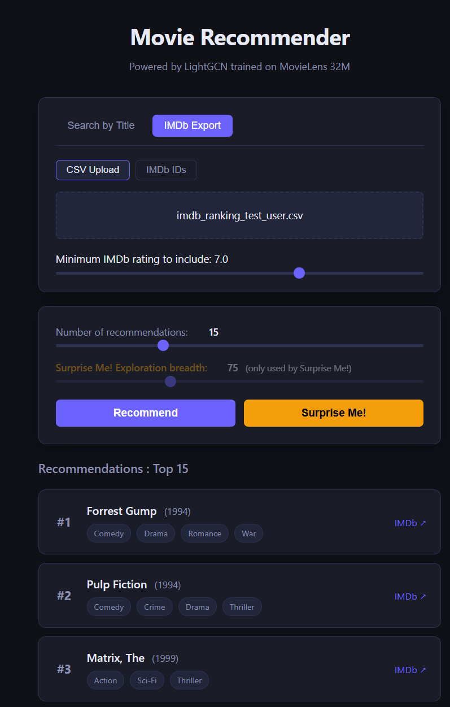

# Movie Recommender System – Portfolio Project

End-to-end recommender system on MovieLens 32M (~32M ratings, ~200k users, ~87k movies) implementing and comparing multiple collaborative filtering paradigms from matrix factorisation baselines to graph neural networks with ranking-focused evaluation, Optuna hyperparameter tuning, and a FastAPI inference service.

> **Goal**: Showcase skills for a Junior **AI/ML Engineer / Data Scientist** role.

---

## Project Overview

Using the [MovieLens 32M](https://grouplens.org/datasets/movielens/32m/) dataset (~32 million explicit ratings, ~200k users, ~87k movies) this project:

- Performs thorough **EDA** (sparsity, long‑tail, temporal patterns, genre effects, tag analysis) to inform modelling decisions.
- Implements multiple **collaborative filtering models**, ranging from naive baselines to state‑of‑the‑art graph‑based methods.
- Runs rigorous **hyperparameter tuning** with Optuna and SQLite storage.
- Evaluates all models with **rating prediction metrics** (RMSE, MAE) and **ranking metrics** (NDCG@10, Recall@10, Hit Rate, Coverage, Novelty).
- Exposes the best model via a **FastAPI** web service and a **browser‑based UI** for interactive recommendations.
- Maintains a clean, modular codebase with clear separation between data, models, evaluation, experiments, and inference.

---

## Models Implemented

All models follow a common interface (`BaseRecommender`) and support either rating prediction, ranking, or both.

| Model | Type | Notes |
| ------- | ------ | ------- |
| `GlobalMean` | Baseline (rating) | Global average rating |
| `ItemMean` / `UserMean` | Baseline (rating) | Per‑item / per‑user mean |
| `Bias (ALS)` | Baseline (rating) | Global + user + item biases with L2 reg. |
| `MFSVD` | Matrix Factorisation | Truncated SVD on explicit ratings, works for both tasks |
| `Popularity` | Baseline (ranking) | Global item popularity; sets the floor for ranking metrics |
| `ALS (implicit)` | Matrix Factorisation | Alternating Least Squares on confidence‑weighted implicit feedback |
| `BPR (implicit)` | Bayesian Personalised Ranking | Pairwise ranking loss |
| `LightGCN` | Graph‑based | Graph Convolution Network (He et al. 2020) trained with BPR loss |
| `BiVAE` | Generative (VAE) | Bilateral VAE for CF (Salah et al. 2021), wrapped via Cornac |

**Key detail**: All ranking models use a **leave‑last‑N** temporal split (the last 10 interactions per user for validation/test), which closely mimics a real‑world production setting and gives far more evaluable users than a naive global timestamp split.

---

## Results

All ranking models evaluated on the validation set (leave-last-10 split, relevance threshold ≥ 4.0 stars, 188,120 evaluable users).

| Model | NDCG@10 | Recall@10 | Hit Rate@10 | Coverage | Novelty |
| ------- | --------- | ----------- | ------------- | ---------- | --------- |
| ALS (tuned) | **0.1000** | **0.1147** | **0.4148** | 0.1017 | 10.51 |
| LightGCN (256dim, 2L, 150ep) | 0.0839 | 0.0879 | 0.3318 | 0.3418 | 9.84 |
| MFSVD (tuned) | 0.0825 | 0.0877 | 0.3588 | 0.0518 | 9.87 |
| Popularity | 0.0560 | 0.0613 | 0.2488 | 0.0129 | 8.74 |
| BPR (tuned) | 0.0498 | 0.0550 | 0.2282 | **0.6702** | **14.19** |

**Precision vs. diversity tradeoff**: ALS achieves the best ranking metrics (NDCG, Recall, Hit Rate) but concentrates recommendations on ~10% of the catalogue. LightGCN scores lower on ranking metrics but covers ~34% of the catalogue, producing more diverse results. BPR is the outlier, worst NDCG but highest coverage (67%) and novelty (14.19), meaning it consistently recommends long-tail items. MFSVD is competitive with LightGCN on NDCG despite being a far simpler model. Increasing ALS α to 40 improves coverage to 0.167 at a modest NDCG cost (0.0919), demonstrating a tuneable tradeoff between relevance and diversity.

---

## UI



---

## Project Structure

```md
├── data/                   # MovieLens dataset (not tracked)
│   └── ml-32m/
├── experiments/
│   ├── results/            # saved model checkpoints, metrics.parquet, tuning.db
│   └── ...                 # tuning scripts (tune_als.py, tune_lightgcn.py, ...)
├── models/                 # all model implementations
│   ├── base.py             # BaseRecommender abstract class
│   ├── utils.py            # build_seen_items helper
│   ├── global_mean.py
│   ├── item_mean.py
│   ├── user_mean.py
│   ├── bias.py
│   ├── popularity.py
│   ├── mf_svd.py
│   ├── als.py
│   ├── bpr.py
│   ├── lightgcn.py
│   └── bivae.py
├── app/                    # FastAPI web app & frontend
│   ├── main.py             # API entrypoint
│   ├── schemas.py          # Pydantic request/response models
│   ├── service.py          # business logic layer
│   └── static/
│       ├── index.html      # UI
│       ├── app.js          # Vanilla JS frontend logic
│       └── styles.css      # Clean dark‑mode design
├── evaluate.py             # rating & ranking evaluation routines
├── inference.py            # Recommender class for production usage
├── data.py                 # data loading, filtering, splits
├── baselines.ipynb         # notebook running all baseline models
├── result_check.ipynb      # notebook for loading & inspecting tuning results
├── inference_check.ipynb   # notebook testing the inference pipeline
├── requirements.txt        # pinned dependencies
└── README.md
```

---

## Getting Started

### 1. Clone the repository

```bash
git clone https://github.com/bouhlet0/movie-lens-recommender.git
cd movie-lens-recommender
```

### 2. Install dependencies

Create a virtual environment (Python 3.12 recommended) and install:

```bash
pip install -r requirements.txt
```

**GPU‑accelerated models** (LightGCN, ALS/BPR with cuPy) require an NVIDIA GPU with CUDA 12.x and `cupy-cuda12x`.  
LightGCN uses PyTorch with CUDA support; the `torch` version in `requirements.txt` is compiled for CUDA 12.4.  
To install PyTorch for a different CUDA version or CPU-only, see [pytorch.org/get-started/locally](https://pytorch.org/get-started/locally/).

### 3. Download the data

Place the MovieLens 32M dataset into `data/ml-32m/`. The default `data.py` expects:

```text
data/ml-32m/ratings.csv
data/ml-32m/movies.csv
data/ml-32m/tags.csv
data/ml-32m/links.csv
```

### 4. Run the project

**EDA & baselines**: open `EDA.ipynb` and `baselines.ipynb` in Jupyter.

**Tune a model**: run the relevant tuning script, e.g.:

```bash
python experiments/tune_als.py
python experiments/tune_lightgcn.py
```

**Train the final LightGCN**:

```python
from data import build_dataset
from models.lightgcn import LightGCNModel
import polars as pl

ds = build_dataset(split="leave_last_n", k=10, lln_n=10)
lightgcn_train_df = ds.train_df.filter(pl.col("rating") >= 4.0)

model = LightGCNModel(
    n_users=ds.n_users,
    n_items=ds.n_items,
    embedding_dim=256,
    n_layers=2,
    n_epochs=150,
    lr=5e-4,
    reg_weight=1e-5,
    batch_size=32768,
)
model.fit(lightgcn_train_df)
model.save("experiments/results/lightgcn_model_256dim_150epoch.pkl")
```

**Launch the API**:

```bash
uvicorn app.main:app --reload
```

Then open `http://localhost:8000` to use the interactive UI.

---

## API & UI

The FastAPI server exposes:

| Endpoint | Method | Description |
| ---------- | -------- | ------------- |
| `/` | GET | Interactive UI (static HTML/JS) |
| `/health` | GET | Model status & dimensions |
| `/search` | GET | Fuzzy title search with normalization |
| `/recommend` | POST | Recommendations by titles or IMDb IDs |
| `/upload` | POST | Recommendations from an IMDb ratings CSV export |

The frontend supports:

- Searching movies by title with autocomplete and fuzzy matching
- Selecting multiple favourite movies as removable chips
- Uploading a personal IMDb ratings export (weighted by your ratings)
- Adjusting the number of recommendations (1–50)
- **Surprise Me** mode: samples from the top-N scoring candidates for serendipitous discovery, with tuneable exploration breadth

---

## Evaluation Metrics

**Rating prediction** (for explicit‑feedback models):

- RMSE
- MAE

**Ranking** (for implicit‑feedback & graph models):

- NDCG@10
- Recall@10
- Precision@10
- Hit Rate@10
- MAP@10
- MRR@10
- Coverage (catalogue coverage)
- Novelty (−log₂ of popularity)

All ranking metrics are computed **per user** and averaged over evaluable users (those with at least one relevant item in the validation set, rating ≥ 4.0).

---

## Technologies & Skills Demonstrated

- **Python data stack**: Polars, NumPy, SciPy, Matplotlib, Seaborn
- **Machine Learning & Recommender Systems**: Matrix Factorisation (SVD, ALS, BPR), Graph Neural Networks (LightGCN), Variational Autoencoders (BiVAE); sparse graph construction with SciPy
- **Hyperparameter Optimisation**: Optuna with pruning and SQLite storage
- **Deep Learning**: PyTorch (LightGCN), Cornac (BiVAE)
- **GPU Acceleration**: CuPy (implicit ALS/BPR), PyTorch CUDA
- **API Development**: FastAPI, Pydantic, Uvicorn
- **Inference & Search**: Fuzzy title matching with rapidfuzz, weighted proxy-user embeddings for cold-start inference
- **Frontend**: Vanilla JavaScript, HTML5, CSS3
- **Evaluation**: Offline evaluation with leave-last-N temporal splits (N=10), relevance thresholding (≥ 4.0 stars), robust per-user metric aggregation over 188k evaluable users

---

## Future Improvements

- Add content‑based features (e.g., MovieLens Tags genome) to build a hybrid model.
- Implement model serving in Docker and a CI/CD pipeline for public deployment.
- Experiment with multi‑stage ranking (candidate retrieval → re‑ranking).

---

## References

- He et al., *LightGCN: Simplifying and Powering Graph Convolution Network for Recommendation* (2020)
- Salah et al., *BiVAE: Bilateral Variational Autoencoder for Collaborative Filtering* (2021)
- Hu et al., *Collaborative Filtering for Implicit Feedback Datasets* (2008), ALS variant
- Rendle et al., *BPR: Bayesian Personalized Ranking from Implicit Feedback* (2009)
- [Recommenders](https://github.com/recommenders-team/recommenders): open-source recommender systems library for Best Practices on Recommendation Systems maintained by the [Linux Foundation AI & Data](https://lfaidata.foundation/projects/) (formerly Microsoft Recommenders)

---

## License

This project is licensed under the MIT License – see the [LICENSE](LICENSE) file for details.
